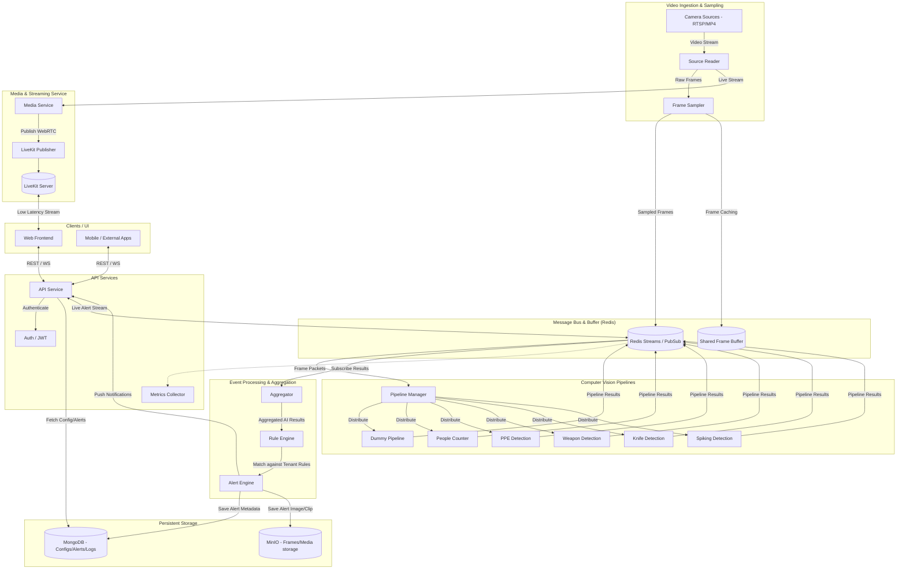

# Architecture Diagram

This document outlines the architecture for the Multi-Camera Computer Vision project. 

## System Architecture

The following diagram illustrates the flow of data from camera sources through the processing pipelines, event evaluation, and out to the frontend via our API and LiveKit services.

## Component Description

### 1. Ingestion Layer
*   **Source Reader**: Connects to the configured cameras (RTSP, video files, etc.) and captures continuous streams.
*   **Frame Sampler**: Samples frames at designated FPS to reduce load, pushing these normalized frames onto the shared message queue (Redis) and storing them in an ephemeral `Shared Buffer`.

### 2. Message Bus
*   **Redis Streams/PubSub**: Acts as the central nervous system of the architecture, decoupling the ingestion, processing, and alerting components. Facilitated by the `redis_stream_sdk`.

### 3. Computer Vision Pipelines
*   **Pipeline Manager**: Orchestrates multiple CV pipelines.
*   **Specialized Pipelines**: Independent modules (e.g., YOLO variants) checking frames for specific scenarios (PPE, Weapons, Counting). Output from these models is serialized as `PipelineResult` and pushed back to the message queue.

### 4. Event Processing
*   **Aggregator**: Listens to outputs from multiple pipelines for the same frame/time window and aggregates them. 
*   **Rule Engine**: Loads per-tenant or per-camera rules to evaluate if the aggregated objects meet conditions for an alert.
*   **Alert Engine**: Processes triggered alerts, persisting them and storing referencing frames in remote object storage.

### 5. API & Services
*   **API Service**: A RESTful / WebSocket service (likely built on FastAPI) that handles frontend requests, user authentication, and streams alerts in real-time.
*   **LiveKit Service**: Allows clients to view low-latency WebRTC streams directly from the source.

### 6. Storage
*   **MinIO**: Object storage designed for saving captured rule-violating frames or incident video clips securely.
*   **MongoDB**: Primary NoSQL datastore managing configurations (cameras, tenants, rules) and logs/alerts.
