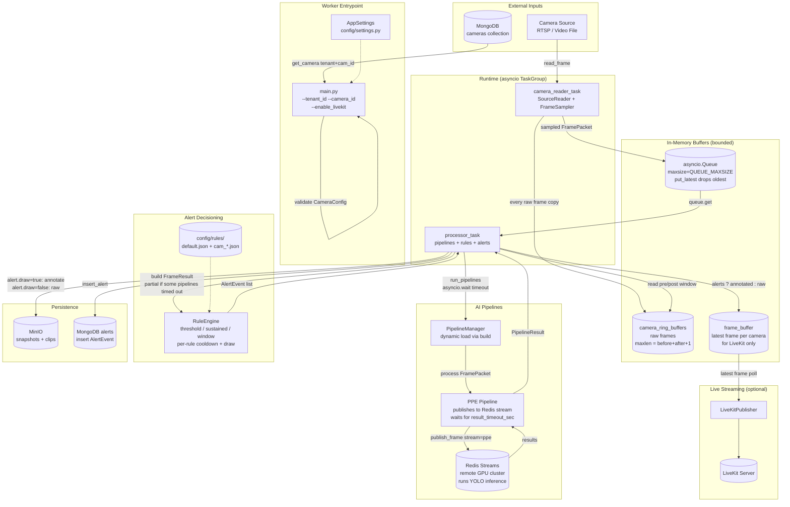

# Architecture Diagram

This document describes the architecture of the single-camera processing worker.
One worker process handles one camera (one `(tenant_id, camera_id)` pair) end-to-end:
reads frames, runs AI pipelines, evaluates alert rules, persists alerts and media,
and optionally streams the live feed to LiveKit.

## System Architecture

## Component Description

### Entrypoint: `main.py`
- One worker process = one camera. CLI args: `--tenant_id`, `--camera_id`, optional `--enable_livekit`.
- Loads the camera config from MongoDB (`mongo_store.get_camera`), validates against `CameraConfig` (Pydantic).
- Constructs `PipelineManager` with only the pipelines listed in `camera.pipelines` (dynamic `build()` discovery).
- Spawns `camera_reader_task` and `processor_task` inside an `asyncio.TaskGroup` — one crash cancels the sibling.

### Reader: `core/source_reader.py` + `core/frame_sampler.py`
- `SourceReader` opens RTSP or local video file based on `camera.source_type`.
- For RTSP: on `read_frame() == None`, reconnects automatically.
- For file: ends cleanly with `queue.put(None)` sentinel.
- `FrameSampler` enforces `target_fps` — frames between samples are still pushed to the ring buffer
  (full FPS for clip generation) but not enqueued to the pipeline queue.
- `FramePacket.frame_id` auto-generated as `{tenant_id}_{camera_id}_{12-char hex}`.

### Backpressure: `put_latest`
- The `asyncio.Queue` between reader and processor is bounded.
- When full, the oldest queued FramePacket is dropped (latest-frame-wins for live streams).
- Drop is logged as `frame_dropped_queue_full` so operators can see when the worker falls behind.

### Pipelines: `pipelines/ppe/` (active)
- PPE is the only active pipeline today, following the **remote inference** pattern:
  - `process(frame_packet)` publishes the frame to a Redis Stream (`stream_name="ppe"`).
  - A separate GPU cluster consumer runs YOLO and publishes results back.
  - PPE waits up to `result_timeout_sec` (config) for results, then returns empty on timeout.
- New pipelines: drop a folder under `pipelines/<name>/` exposing a `build(app_settings)` function.
  Zero changes to `pipeline_manager.py` required.

### Pipeline timeout: `core/pipeline_manager.py`
- `run_pipelines(packet, timeout_sec)` uses `asyncio.wait()` with timeout.
- Stragglers are cancelled and logged as `pipeline_timed_out`.
- Failed pipelines are logged as `pipeline_failed` with the exception.
- Returns whatever finished in time. If 0 results, the frame is skipped.

### Ring buffer: `camera_ring_buffers`
- Bounded `deque(maxlen=ALERT_FRAMES_BEFORE + ALERT_FRAMES_AFTER + 1)` per camera_id.
- Stores **every raw frame** at full FPS (not just sampled ones) — needed for smooth clip playback.
- Independent of the AI pipeline, so a slow pipeline doesn't break clip generation.

### Rules: `core/rule_engine.py` + `config/rule_loader.py`
- Three rule types:
  - `threshold` — fires on a single frame's confidence ≥ threshold.
  - `sustained` — fires after N strictly consecutive frames.
  - `window` — fires when ≥M of the last N frames had detection (more robust than sustained on noisy streams).
- Per-rule `cooldown_sec` (own `CooldownSuppressor` instance) — independent windows across rules.
- Per-rule `draw` flag — controls whether snapshot/clip/live frame is annotated for that alert.
- Rules loaded from `config/rules/default.json` + optional `config/rules/{camera_id}.json` overrides.

### Alert flow: `_process_and_save_alerts` in `main.py`
1. Run rule engine first; if no alerts, push raw frame to LiveKit (when enabled) and return.
2. For each alert:
   - `save_alert_snapshot` (offloaded to thread) — annotate iff `alert.details["draw"]`, upload to MinIO.
   - `save_alert_clip` — daemon thread waits for post-alert frames in ring buffer, writes WebM, uploads.
   - `mongo_store.insert_alert` (offloaded to thread) — persist AlertEvent.
   - `AlertEvent.alert_id` auto-generated as `{tenant_id}_{camera_id}_{12-char hex}`.
3. If LiveKit enabled, push the annotated frame to `frame_buffer`.

### LiveKit (optional)
- Gated by `--enable_livekit` arg. If disabled, `frame_buffer.put()` is skipped entirely.
- `LiveKitPublisher.start([camera])` takes a single-camera list (multi-camera leftover signature).

### Persistence
- **MongoDB** (`storage/mongo_store.py`): single collection for camera configs, single collection for alerts.
  Only `get_camera` is used at startup; `insert_alert` is the runtime write path.
- **MinIO** (`storage/minio_client.py`): partitioned by `{tenant_id}/{camera_id}/alerts/{alert_id}/`.
  Both snapshot and clip share the same prefix.
